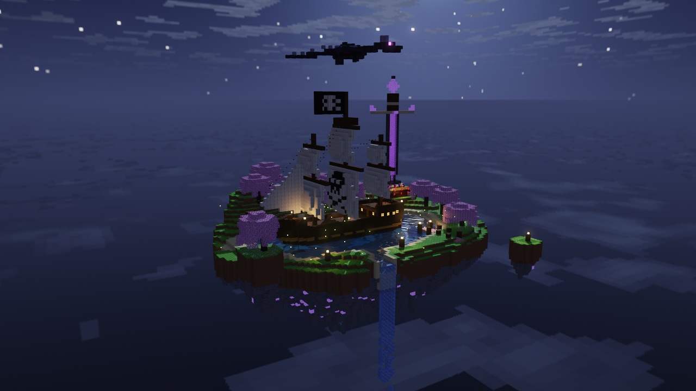
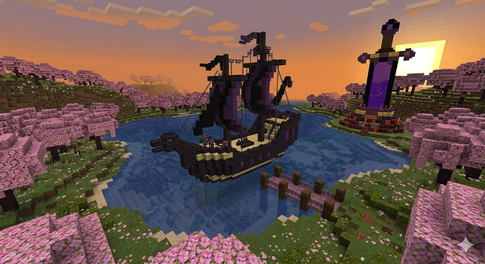
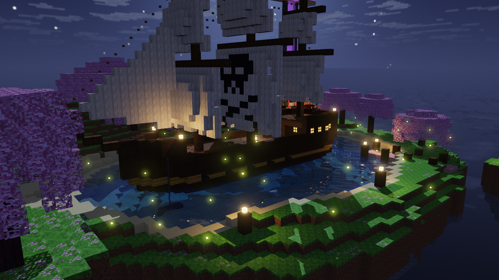
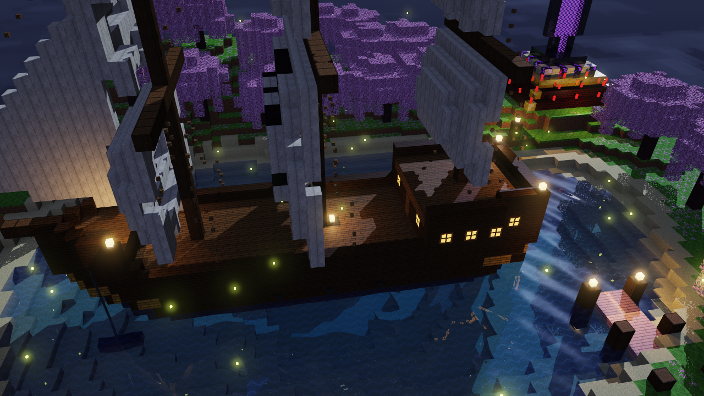
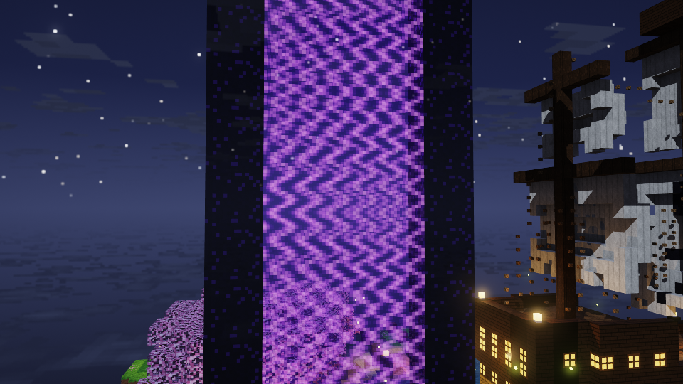

# Diorama Minecraft: barco pirata en una isla flotante

Diorama estilo Minecraft renderizado con **raytracing**, hecho en Rust sin librerías externas. La escena es una isla flotante con un bosque de cerezos, de noche. En el centro hay un lago con un barco pirata anclado y, a un lado, un monumento con forma de espada cuya hoja es un portal del Nether. Sobre la isla vuela en círculos un dragón del End, y la escena tiene música de fondo.



## Idea inicial

Antes de programar, generé esta imagen con **Nano Banana** para tener una referencia de cómo quería que se viera el producto final:



A partir de esa idea, la escena final se fue transformando:

- **El barco del End** se convirtió en un **barco pirata** que flota sobre el agua.
- **El terreno plano** pasó a ser una **isla flotante**, con su parte de abajo de roca y estalactitas.
- **El atardecer** cambió a una **noche** iluminada por la luna, faroles y luciérnagas.
- **El lago** es más grande, y se agregaron un muelle e islotes flotantes.

## Capturas

| Barco pirata | Refracción en el agua |
|---|---|
|  |  |

| Portal translúcido |
|---|
|  |

## Qué incluye la escena

- **Isla flotante** con colinas, playa, un bosque de cerezos y una parte inferior de roca con cristales de amatista que brillan.
- **Lago** con agua transparente, donde se ven el fondo y la cadena del ancla. Un arroyo sale del lago hasta el borde de la isla y cae como **cascada** al vacío.
- **Barco pirata**:
  - casco de madera con cañones;
  - tres mástiles con velas rasgadas, la vela mayor con calavera y bandera pirata;
  - puesto de vigía, cuerdas y ventanas iluminadas en el camarote.
- **Monumento de espada** con pedestal escalonado, velas encendidas y una hoja de portal morado translúcido.
- **Muelle**, faroles e islotes flotantes alrededor.
- **Dragón del End** con alas, cuernos y ojos morados brillantes, que vuela en círculos sobre la isla.
- **Noche**: luna, estrellas, nubes y un mar de nubes debajo de la isla.

## Técnicas de render

- Raytracing con sombras, incluidas sombras de color cuando la luz pasa por el agua o el vidrio.
- **Reflexión** en materiales como el oro, la obsidiana y el agua.
- **Refracción** en el agua del lago y en el vidrio del portal, con efecto Fresnel (en ángulos bajos se refleja más).
- **Skybox** tipo cubemap (6 caras) con el cielo nocturno.
- Texturas pixel art de 16×16 generadas por el programa, una para cada material.
- Hojas con huecos (se ve a través de ellas) y un portal con transparencia por pixel.
- Oclusión ambiental estilo Minecraft, ondas en el agua, bloom y antialiasing progresivo.
- Render en varios hilos, con una vista previa rápida mientras la cámara se mueve.

## Materiales

Cada material tiene su propia textura y sus propios valores de albedo, especular, reflectividad y transparencia. Algunos ejemplos:

| Material | Característica |
|---|---|
| Agua | Transparente, refracta la luz y absorbe más el color rojo (por eso se ve azul) |
| Vidrio de portal | Translúcido por pixel y emite luz morada |
| Bloque de oro | Muy reflejante |
| Obsidiana | Oscura, con brillo y un reflejo suave |
| Hojas de cerezo | Con huecos para ver a través de ellas |
| Amatista, farol, velas | Emiten luz propia |

En total hay más de 30 materiales: pasto, tierra, piedra, minerales, arena, troncos, distintos tablones, lana, cadenas, hierro y otros.

## Cómo correrlo

Se necesita **Rust** instalado. La ventana interactiva funciona en **Windows**.

```bash
cargo run --release
```

### Música

Pon tus canciones (`.mp3`, `.wav` o `.wma`) en la carpeta `musica/`. Se reproducen en orden alfabético por nombre de archivo y, cuando termina una, empieza la siguiente. Se usa el reproductor que ya trae Windows, sin librerías externas.

También se puede generar una imagen sin abrir la ventana:

```bash
cargo run --release -- --render captura.png --samples 32
```

| Opción | Uso |
|---|---|
| `--width N` / `--height N` | Resolución (por defecto 1280×720) |
| `--render archivo.png` | Renderiza sin ventana y guarda un PNG |
| `--samples N` | Muestras por pixel al usar `--render` |
| `--yaw G --pitch G --dist D` | Vista inicial alrededor de la isla |
| `--export-textures` | Guarda las texturas y el skybox como imágenes en `assets/` |
| `--info` | Muestra la tabla de materiales |

## Controles

| Tecla | Acción |
|---|---|
| W A S D | Moverse |
| Espacio / E | Subir |
| Ctrl / Q | Bajar |
| Shift | Moverse más rápido |
| Arrastrar el ratón / flechas | Mirar alrededor |
| Rueda del ratón | Avanzar y retroceder |
| Z / X | Rotar el diorama |
| + / - | Acercar y alejar |
| O | Rotación automática |
| F | Pausar o continuar el vuelo del dragón |
| M | Siguiente canción |
| N | Pausar o continuar la música y el dragón |
| R | Reiniciar la cámara |
| B | Activar o desactivar el bloom |
| P | Guardar una captura PNG |
| Esc | Salir |

Mientras el dragón vuela, la imagen se muestra en modo de vista previa. Para ver la imagen en máxima calidad (por ejemplo, para una captura), pausa todo con **N** (música y dragón) o solo el dragón con **F**.

## Estructura del proyecto

```
Minecraft/
├── src/            código fuente
├── assets/
│   ├── textures/   texturas de los bloques (se pueden editar)
│   └── skybox/     las 6 caras del cielo
├── capturas/       imágenes del resultado
├── musica/         canciones de la isla
└── image_dbcd86ff.jpg   imagen de referencia (Nano Banana)
```

Las texturas de `assets/textures` se pueden editar con cualquier editor de imágenes. Si existe el archivo, el programa lo usa en lugar de la textura que genera.
